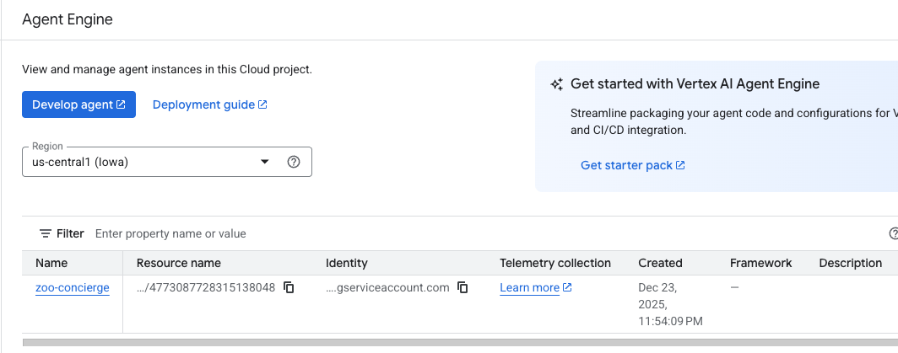
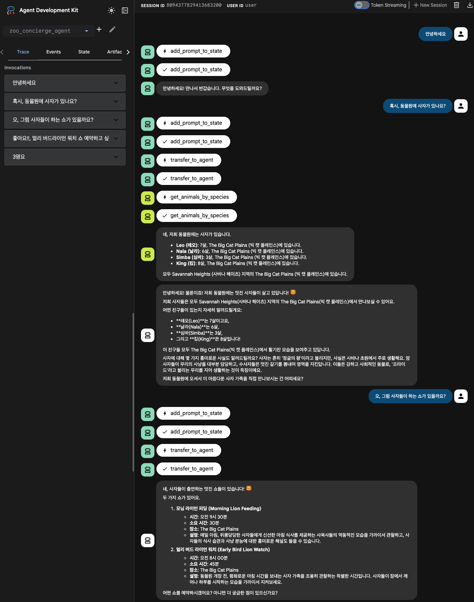
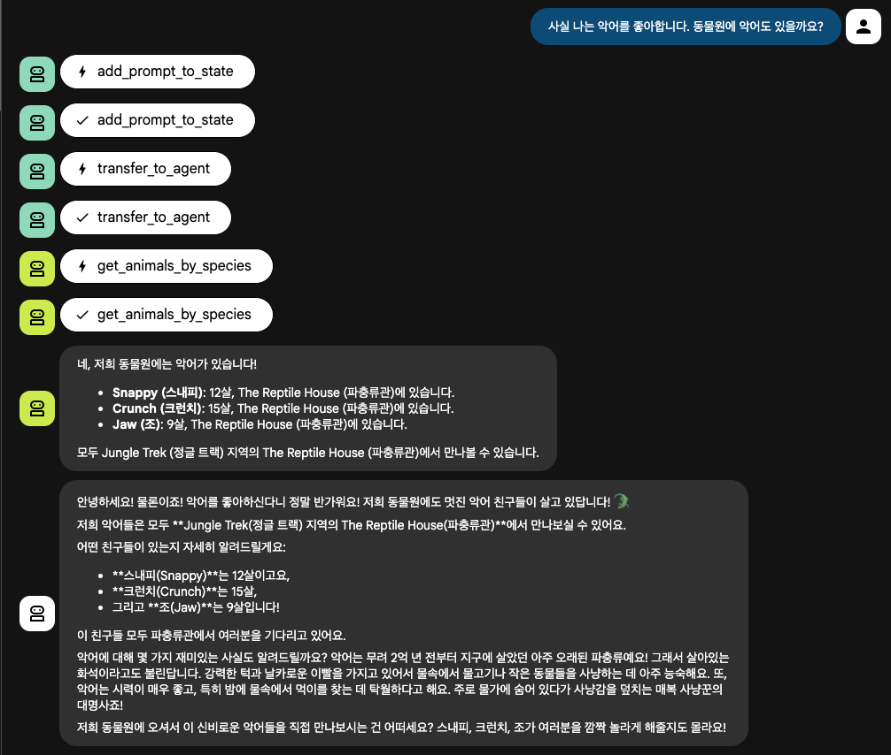
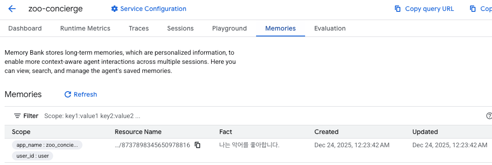

# Cloud Run 에서 ADK 기반 멀티 AI 에이전트 환경 구성
#ADK, #A2A, #MCP, #Cloud Run, #AgentEngine-MemoryBank

## 🌟 개요

이 프로젝트는 Cloud Run 에서 Google ADK 기반의 멀티 에이전트 AI 시스템을 배포하기 위한 구성을 제공합니다. 동물원 방문객에게 동물 정보를 제공하고 동물 쇼 예약 서비스를 지원하는 **동물원 컨시어지 시스템(Zoo Concierge System)**이라는 사례를 통해 AI 에이전트의 협업 및 확장 가능성을 시연합니다.

### 🚀 주요 기술
*   **Terraform**: 클라우드 리소스를 일관되게 정의하고 프로비저닝하기 위한 코드형 인프라(IaC) 도구입니다.
*   **Google Cloud Run**: 확장성이 뛰어난 컨테이너화된 애플리케이션을 배포하기 위한 완전 관리형 서버리스 플랫폼입니다.
*   **Model Context Protocol (MCP)**: AI 모델이 외부 데이터 소스 및 도구에 안전하게 연결할 수 있도록 하는 개방형 표준입니다.
*   **Google ADK (Agent Development Kit)**: GenAI 에이전트를 구축, 테스트 및 배포하기 위한 Python 프레임워크입니다.
*   **A2A (Agent-to-Agent) Protocol**: 독립적인 에이전트들이 서로를 검색하고 상호 작용하여 복잡한 작업을 협업하여 해결할 수 있도록 하는 메커니즘입니다.

### 🤖 주요 AI 에이전트 구성 요소


*   **zoo_concierge_agent**: 이 에이전트는 시스템의 주요 사용자 접점 역할을 합니다. 사용자의 요청을 받아 "연구원(Researcher)" 역할을 수행하는 하위 에이전트에게 동물원 데이터(zoo_animal_mcp_server) 및 일반적인 사실 정보(Google 검색)를 문의하여 답변을 제공합니다. 또한, 동물 쇼 예약과 같은 전문적인 요청은 `zoo_show_agent`와 같은 전담 에이전트에게 라우팅합니다. 이 때 A2A Protocol 을 통해 멀티 에이전트가 통신하는 기능을 보여줍니다.
        AgentEngine 의 MemoryBank 를 사용하여 Session 과 Memory 를 장기 기억 정보로 관리합니다.

*   **zoo_show_agent**: 이 전문 에이전트는 동물 쇼 일정 관리 및 예약 요청 처리를 전담합니다. `zoo_concierge_agent`와 **A2A(Agent-to-Agent)** 프로토콜을 통해 통신하며, 각 에이전트가 특정 도메인 지식을 활용하여 복잡한 작업을 효율적으로 분담 처리하는 방식을 보여줍니다.

*   **zoo_animal_mcp_server**: MCP(Model Context Protocol) 서버는 동물원에 서식하고 있는 동물에 대한 정보를 제공합니다. `zoo_concierge_agent` 는 이 MCP 서버를 통해 동물원의 동물 정보를 조회 합니다.

*   **zoo_show_mcp_server**: MCP(Model Context Protocol) 서버는 동물원의 동물 쇼 일정 정보를 관리합니다. `zoo_show_agent`는 이 MCP 서버를 통해 동물 쇼 관련 데이터를 조회합니다.

### 🏗️ 주요 인프라 구성 요소


전체 인프라는 **Terraform**을 사용하여 프로비저닝됩니다. 이는 VPC(Virtual Private Cloud), 비공개 네트워킹, 서비스 계정(IAM) 정책을 포함하는 안전하고 프로덕션 환경에 적합한 환경을 코드로서 관리하는 것을 보장합니다. 모든 에이전트 및 MCP 서버는 서버리스 플랫폼인 **Google Cloud Run**에 배포되어 자동 확장, 고가용성 및 관리 용이성을 제공합니다.

`terraform/` 디렉토리에는 다음을 프로비저닝하는 스크립트가 포함되어 있습니다:

-   **네트워킹 (Networking):**
    -   `google_compute_network`: 격리를 위한 커스텀 VPC (`run-ai-apps-network`).
    -   `google_compute_subnetwork`: 리소스를 위한 서브넷 (`run-ai-apps-subnet`).
    -   `google_compute_router` & `google_compute_router_nat`: 외부 IP 없이 안전한 아웃바운드 인터넷 액세스를 위한 Cloud Router 및 NAT.
-   **보안 및 IAM (Security & IAM):**
    -   `google_service_account`: 에이전트를 위한 전용 ID (`run-ai-apps-sa`).
    -   `google_project_iam_member`: 서비스 계정에 할당된 세분화된 권한 (Vertex AI User, Cloud Run Invoker).
-   **비공개 연결 (Private Connectivity):**
    -   `google_compute_global_address` & `google_compute_global_forwarding_rule`: Private Service Connect (PSC) 설정.
    -   `google_dns_managed_zone` & `google_dns_record_set`: PSC를 통해 Google API 트래픽을 안전하게 라우팅하기 위한 비공개 DNS.
-   **서비스 (Services):**
    -   `google_project_service`: 필요한 API 활성화 (Cloud Run, Vertex AI, Cloud Build 등).


## 🛠️ 시작하기

### ⚙️ Terraform을 통한 인프라 설정
이 섹션에서는 Terraform을 사용하여 GCP에 인프라를 설정하는 단계를 설명합니다. VPC 네트워크, 서브넷, 서비스 계정 등 안전한 에이전트 실행을 위한 기반 환경을 자동으로 프로비저닝합니다.

1.  **환경 변수 설정:**
    `run-adk-agent` 디렉토리의 루트에서 시작합니다. 프로젝트 ID와 리전 정보를 환경 변수로 설정하여 이후 단계에서 재사용합니다.
    
    ```bash
    cd run-adk-agent
    ```

    ```bash
    # <your-gcp-project-id> 부분을 실제 프로젝트 ID로 변경하거나, gcloud 설정에서 가져옵니다.
    export PROJECT_ID=$GOOGLE_CLOUD_PROJECT
    export LOCATION=us-central1
    ```

2.  **`terraform.tfvars` 업데이트:**
    설정한 환경 변수(`PROJECT_ID`, `LOCATION`)를 Terraform 변수 파일(`terraform.tfvars`)에 주입하여 Terraform이 올바른 프로젝트와 리전에 리소스를 생성하도록 합니다.

    ```bash
    sed -i \
    -e "s/your-gcp-project-id/${PROJECT_ID}/" \
    -e "s/your-location/${LOCATION}/" \
    ./terraform/terraform.tfvars
    ```

3.  **Terraform 초기화 및 적용:**
    Terraform을 초기화(`init`)하고, 변경 사항을 계획(`plan`)한 후, 실제 인프라를 생성(`apply`)합니다. `--auto-approve` 옵션은 사용자 확인 없이 즉시 적용합니다.

    ```bash
    terraform -chdir=terraform init
    terraform -chdir=terraform plan
    terraform -chdir=terraform apply --auto-approve
    ```

    **📝 출력 결과(Outputs) 확인:** Terraform 실행이 완료되면 생성된 주요 리소스의 이름이 출력됩니다. 이 값들은 이후 배포 과정에서 환경 변수로 사용되므로 확인이 필요합니다.
    ```text
    network_name = "run-ai-apps-network"
    subnetwork_name = "run-ai-apps-subnet"
    service_account_account_id = "run-ai-apps-sa"
    ```

### ☁️ 기본 배포 환경 구성
이 섹션에서는 AI 에이전트와 MCP 서버 배포를 위한 기본 환경을 구성하는 방법을 안내합니다. Terraform으로 생성된 리소스 정보를 환경 변수로 설정하고, 배포에 필요한 권한을 부여하며, 필수 도구인 ADK를 설치합니다.

1.  **배포 환경 구성:**
    Terraform 출력값(네트워크, 서브넷, 서비스 계정)과 프로젝트 정보, 에이전트 설정 등을 환경 변수로 내보냅니다. 이 변수들은 이후 `gcloud run deploy` 및 `adk deploy` 명령에서 사용됩니다.

    ```bash
    # Terraform 출력에서 리소스 정의
    export NETWORK_NAME=run-ai-apps-network
    export SUBNET_NAME=run-ai-apps-subnet

    export SERVICE_ACCOUNT=run-ai-apps-sa

    # 사용자 구성
    export PROJECT_NUMBER=$(gcloud projects describe ${PROJECT_ID} --format="value(projectNumber)")
    export MEMBER=$(gcloud config get-value account)

    export AGENT_NAME=zoo-concierge

    # AI 모델 구성 (Gemini 2.5 Flash 사용)
    export GEMINI_MODEL=gemini-2.5-flash    
    ```

2.  **배포자 권한 부여:**
    현재 작업 중인 사용자 계정(`$MEMBER`)에 Cloud Run 배포, 서비스 계정 사용, Cloud Build 실행에 필요한 권한을 부여합니다. 이는 스크립트 실행 시 권한 오류를 방지하기 위함입니다.

    ```bash
    # Cloud Run 관리자 역할 부여
    gcloud projects add-iam-policy-binding ${PROJECT_ID} \
        --member="user:$MEMBER" \
        --role="roles/run.admin"

    # 서비스 계정 사용자 역할 부여
    gcloud projects add-iam-policy-binding ${PROJECT_ID} \
        --member="user:$MEMBER" \
        --role="roles/iam.serviceAccountUser"

    # Cloud Build 편집자 역할 부여
    gcloud projects add-iam-policy-binding ${PROJECT_ID} \
        --member="user:$MEMBER" \
        --role="roles/cloudbuild.builds.editor"
    ```

3.  **Google ADK 설치:**
    에이전트를 빌드하고 배포하기 위해 Google Agent Development Kit (ADK)를 설치합니다. 파이썬 가상 환경을 사용하여 시스템 패키지와 분리된 환경을 구성합니다.

    참조: [ADK 설치 가이드](https://google.github.io/adk-docs/get-started/installation/)
    ```bash
    python3 -m venv .venv
    source .venv/bin/activate
    pip install google-adk
    ```

### 🧠 MemoryBank 사용을 위한 AgentEngine 생성
AgentEngine은 AI 에이전트의 "기억(Memory)"을 담당하는 핵심 컴포넌트입니다. 사용자와의 대화 내용을 저장하고(Session), 장기 기억(MemoryBank)을 관리하여 에이전트가 문맥을 파악하고 개인화된 응답을 제공할 수 있게 합니다.

AgentEngine 에 에이전트를 배포하지 않고 다른 환경(Cloud Run, Colab 등)에 AI 에이전트를 배포하더라도 MemoryBank 사용이 가능합니다.
https://docs.cloud.google.com/agent-builder/agent-engine/memory-bank/set-up#other-runtime


1.  **프로비저닝 스크립트 실행 (`provisioning.py`):**
    제공된 파이썬 스크립트를 사용하여 AgentEngine 인스턴스를 생성합니다.

    ```bash
    python3 ./agentengine/provisioning.py \
      --project_id ${PROJECT_ID} \
      --location ${LOCATION} \
      --agent_name ${AGENT_NAME} \
      --model ${GEMINI_MODEL}
    ```

    실행결과 (예시): 생성된 Agent Engine의 고유 ID가 출력됩니다.
    ```bash
    $ python3 ./agentengine/provisioning.py \
        --project_id ${PROJECT_ID} \
        --location ${LOCATION} \
        --agent_name ${AGENT_NAME} \
        --model ${GEMINI_MODEL}
    4773087728315138048
    ```

    나온 결과값(Agent Engine ID)을 `AGENT_ENGINE_ID` 환경 변수에 설정해야 합니다. 이후 에이전트 배포 시 이 ID를 사용하여 AgentEngine과 연결합니다.
    ```bash
    export AGENT_ENGINE_ID=4773087728315138048
    ```
    

    **(참고) AgentEngine 삭제:** 만약 생성한 AgentEngine 리소스를 정리하고 싶다면 다음 명령어를 사용하세요.
    ```bash
    python3 ./agentengine/cleaning.py \
      --project_id ${PROJECT_ID} \
      --location ${LOCATION} \
      --agent_engine_id ${AGENT_ENGINE_ID}
    ```

### 🚀 Cloud Run 에 MCP Server 배포

1.  **Zoo Animal MCP 서버 배포:**
    ```bash
    gcloud run deploy zoo-animal-mcp-server \
        --source ./zoo_animal_mcp_server/ \
        --region ${LOCATION} \
        --service-account ${SERVICE_ACCOUNT} \
        --no-allow-unauthenticated \
        --network=${NETWORK_NAME} \
        --subnet=${SUBNET_NAME} \
        --vpc-egress=all-traffic \
        --ingress internal
    ```

2.  **Zoo Show MCP 서버 배포:**
    ```bash
    gcloud run deploy zoo-show-mcp-server \
        --source ./zoo_show_mcp_server/ \
        --region ${LOCATION} \
        --service-account ${SERVICE_ACCOUNT} \
        --no-allow-unauthenticated \
        --network=${NETWORK_NAME} \
        --subnet=${SUBNET_NAME} \
        --vpc-egress=all-traffic \
        --ingress internal
    ```

3.  **에이전트 환경 구성 (.env):**

    각 에이전트가 MCP 서버의 주소와 Google Cloud 프로젝트 ID를 알 수 있도록 환경 변수 파일(.env)에 설정 합니다.

    ```bash
    # Concierge Agent를 위한 .env 생성 (Animal MCP에 연결)
    echo "MCP_SERVER_URL=https://zoo-animal-mcp-server-${PROJECT_NUMBER}.${LOCATION}.run.app/mcp" >> ./zoo_concierge_agent/.env

    # Show Agent를 위한 .env 생성 (Show MCP에 연결)
    echo "MCP_SERVER_URL=https://zoo-show-mcp-server-${PROJECT_NUMBER}.${LOCATION}.run.app/mcp" >> ./zoo_show_agent/.env

    # .env 파일 내 프로젝트 ID 업데이트
    sed -i -e "s|your-gcp-project-id|${PROJECT_ID}|" ./zoo_concierge_agent/.env
    sed -i -e "s|your-gcp-project-id|${PROJECT_ID}|" ./zoo_show_agent/.env
    ```

    > 명령어 실행 이후 ./zoo_concierge_agent/.env 와 ./zoo_show_agent/.env 에 내용이 잘 반영되었는지 반드시 확인합니다.

### 🤖 Cloud Run 에 ADK Agent 배포

이제 실제 AI 에이전트들을 배포합니다. ADK의 `adk deploy` 명령어를 사용하여 로컬 소스를 빌드하고 Cloud Run 서비스로 배포합니다. A2A(Agent-to-Agent) 통신을 위해 하위 에이전트(Show Agent)를 먼저 배포하고, 이를 상위 에이전트(Concierge Agent)에 연결합니다.


1.  **Zoo Show Agent 배포 (A2A 대상):**

    이 에이전트는 쇼 예약이라는 전문 작업을 처리하는 하위 에이전트입니다. `--a2a` 플래그는 이 에이전트가 다른 에이전트로부터 호출될 수 있음을 나타냅니다.

    ```bash
    adk deploy cloud_run \
      --project=${PROJECT_ID} \
      --region=${LOCATION} \
      --service_name=zoo-show-agent \
      --a2a \
      --artifact_service_uri=memory:// \
      ./zoo_show_agent \
      -- --allow-unauthenticated \
      --service-account ${SERVICE_ACCOUNT} \
      --network=${NETWORK_NAME} \
      --subnet=${SUBNET_NAME}  \
      --vpc-egress=all-traffic
    ```

2.  **에이전트 연결:**
    A2A 프로토콜을 사용하여 배포된 `zoo_show_agent`를 가리키도록 `zoo_concierge_agent` 구성을 업데이트합니다.

    ```bash    
    cp ./zoo_show_agent/agent.json ./zoo_concierge_agent/agent.json
    ```
    ```bash
    # 배포된 URL로 에이전트 카드 업데이트
    sed -i -e "s|your_agent_server_url|https://zoo-show-agent-${PROJECT_NUMBER}.${LOCATION}.run.app/a2a/zoo_show_agent|" ./zoo_concierge_agent/agent.json
    ```

3.  **Zoo Concierge Agent 배포 (메인 진입점):**

    사용자가 상호 작용하는 메인 에이전트입니다.

    * SessionService 와 MemoryService 로 AgentEngine 의 MemoryBank 를 설정합니다.
        ```
        --session_service_uri=agentengine://${AGENT_ENGINE_ID} \
        --memory_service_uri=agentengine://${AGENT_ENGINE_ID} \
        ```
    * Cloud Run 에서 Permission Error 발생하는 이슈 해결을 위해 설정 (아래 문제 해결 참조))
      ```
        --artifact_service_uri=memory:// \
        ```
    ```bash
    adk deploy cloud_run \
      --project=${PROJECT_ID} \
      --region=${LOCATION} \
      --service_name=zoo-concierge-agent \
      --with_ui \
      --session_service_uri=agentengine://${AGENT_ENGINE_ID} \
      --memory_service_uri=agentengine://${AGENT_ENGINE_ID} \
      --artifact_service_uri=memory:// \
      ./zoo_concierge_agent \
      -- --allow-unauthenticated \
      --service-account ${SERVICE_ACCOUNT} \
      --network=${NETWORK_NAME} \
      --subnet=${SUBNET_NAME}  \
      --vpc-egress=all-traffic
    ```

## 🎮 사용 방법
사용자와 소통하는 zoo_concierge_agent 를 통해 서비스에 접근할수 있다.







## 📚 참조 및 리소스

-   **Codelab: Secure MCP Server on Cloud Run:** [Link](https://codelabs.developers.google.com/codelabs/cloud-run/how-to-deploy-a-secure-mcp-server-on-cloud-run?hl=ko#6)
-   **Codelab: ADK Agent with MCP:** [Link](https://codelabs.developers.google.com/codelabs/cloud-run/use-mcp-server-on-cloud-run-with-an-adk-agent?hl=ko#0)
[Use MCP Server on Cloud Run with an ADK Agent](https://codelabs.developers.google.com/codelabs/cloud-run/use-mcp-server-on-cloud-run-with-an-adk-agent#8)


## 문제 해결 (Troubleshooting)

<details>
<summary>Cloud Run / GKE 배포 시 Permission Error (google-adk 1.21+ 이슈)</summary>

*   **참조 이슈:** [github.com/google/adk-python/issues/3907](https://github.com/google/adk-python/issues/3907)

**1. 문제 배경**

`google-adk` 1.21 버전은 이전 버전(특히 1.20 이하)과 비교했을 때 **아티팩트 및 세션 관리 로직**에서 중요한 변화가 있었습니다. 해당 에러(`PermissionError`)가 발생하는 이유는 1.21 버전부터 에이전트의 실행 추적성과 상태 관리 기능이 강화되면서, 실행 시점에 내부적으로 생성하는 데이터(Artifacts)의 비중이 커졌기 때문입니다.
```
  File "/home/myuser/.local/lib/python3.11/site-packages/google/adk/cli/utils/local_storage.py", line 106, in create_local_artifact_service
    artifact_root.mkdir(parents=True, exist_ok=True)
  File "/usr/local/lib/python3.11/pathlib.py", line 1120, in mkdir
    self.parent.mkdir(parents=True, exist_ok=True)
  File "/usr/local/lib/python3.11/pathlib.py", line 1116, in mkdir
    os.mkdir(self, mode)
PermissionError: [Errno 13] Permission denied: '/app/agents/.adk'
```

**2. 상세 원인**

*   **아티팩트 서비스(Artifact Service)의 역할 강화:** 1.21 버전부터는 에이전트가 실행되는 동안 발생하는 중간 데이터나 로그 성격의 아티팩트를 관리하는 로직이 더 정교해졌습니다. 이전에는 단순히 환경 변수나 설정으로 넘기던 데이터들을 이제는 명시적인 '아티팩트 서비스'를 통해 저장하려고 시도합니다.
*   **세션 관리 로직의 변화:** `add_session_to_memory`와 같은 세션 보존 기능이 추가되면서, 세션 상태를 저장하기 위해 파일 시스템에 접근하려는 빈도가 높아졌습니다.
*   **로컬 파일 시스템 의존성 vs Cloud Run 제약:** 별도의 설정이 없을 경우, ADK는 `./agents/.adk` 폴더를 기본 저장소로 사용하도록 설계되었습니다. 하지만 **Cloud Run 및 GKE 컨테이너 환경은 기본적으로 `/app` 경로가 읽기 전용(Read-only)**이거나 권한이 매우 제한적입니다. 따라서 ADK가 해당 경로에 쓰기를 시도할 때 `Permission denied` 에러가 발생합니다.

**3. 해결 방법: `--artifact_service_uri=memory://`**

이 옵션은 ADK에게 **"데이터를 디스크(Permission이 필요한 곳)에 쓰지 말고, 컨테이너가 할당받은 RAM(메모리) 공간에만 임시로 저장하라"**고 명령하는 것과 같습니다.

*   **기존 방식 (Error):** `adk deploy` → Cloud Run/GKE 실행 → `/app/.adk` 폴더 생성 시도 → 거부 (Permission Denied)
*   **해결 방식 (Success):** `adk deploy` → `--artifact_service_uri=memory://` 설정 → Cloud Run/GKE → 메모리에 데이터 적재 → 정상 작동

**적용 예시:**

```bash
adk deploy  \
  ...
  --artifact_service_uri=memory:// \
  ...
```

</details>